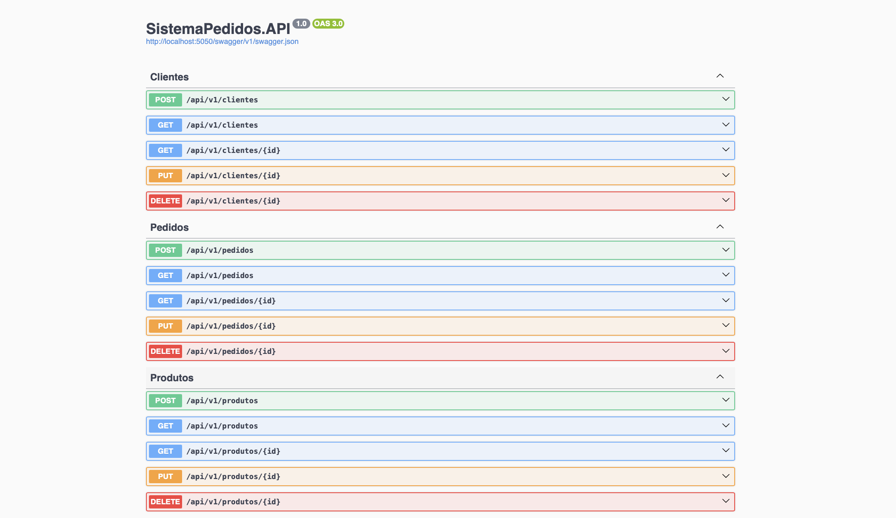

# SistemaPedidos



---

## Introdução

SistemaPedidos é uma API Restful em ASP.NET com Clean Architecture, que gerencia clientes, produtos e pedidos. O sistema está organizado em camadas, usa DTOs para transferência de dados e AutoMapper para mapeamento entre entidades e DTOs. O banco utilizado é PostgreSQL, acessado via Entity Framework Core.

---

## Arquitetura Geral

-   **Clean Architecture**  
    Separação clara das responsabilidades em camadas:
    -   Domain: entidades e regras de negócio
    -   Application: DTOs e lógica de aplicação
    -   Infrastructure: acesso a dados
    -   API: camada de apresentação e controllers

---

## Requisitos

-   [.NET 9 SDK](https://dotnet.microsoft.com/pt-br/download) (para rodar testes e executar localmente)
-   [Docker](https://docs.docker.com/get-docker/) (para rodar a API e banco via containers)

---

## Endpoints da API

### Cliente

| Método | Endpoint              | Descrição                |
| ------ | --------------------- | ------------------------ |
| GET    | /api/v1/clientes      | Listar todos os clientes |
| GET    | /api/v1/clientes/{id} | Consultar cliente por ID |
| POST   | /api/v1/clientes      | Criar novo cliente       |
| PUT    | /api/v1/clientes/{id} | Atualizar cliente        |
| DELETE | /api/v1/clientes/{id} | Remover cliente          |

### Produto

| Método | Endpoint              | Descrição                |
| ------ | --------------------- | ------------------------ |
| GET    | /api/v1/produtos      | Listar todos os produtos |
| GET    | /api/v1/produtos/{id} | Consultar produto por ID |
| POST   | /api/v1/produtos      | Criar novo produto       |
| PUT    | /api/v1/produtos/{id} | Atualizar produto        |
| DELETE | /api/v1/produtos/{id} | Remover produto          |

### Pedido

| Método | Endpoint             | Descrição                   |
| ------ | -------------------- | --------------------------- |
| GET    | /api/v1/pedidos      | Listar todos os pedidos     |
| GET    | /api/v1/pedidos/{id} | Consultar pedido por ID     |
| POST   | /api/v1/pedidos      | Criar novo pedido com itens |
| PUT    | /api/v1/pedidos/{id} | Atualizar pedido existente  |
| DELETE | /api/v1/pedidos/{id} | Remover pedido por ID       |

---

## Instruções para rodar o projeto

1. Clone o repositório e acesse o diretório do projeto

```bash
git clone https://github.com/mfelipearaujo/SistemaPedidos.git
cd SistemaPedidos
```

2. Inicie os containers da API e do banco PostgreSQL

```bash
docker-compose up --build
```

3. A API estará disponível em http://localhost:5050/swagger/index.html

4. O banco PostgreSQL estará rodando no container, na porta padrão 5432 (não exposta para o host)

---

## Criar e aplicar migrations (localmente)

Certifique-se de estar no diretório raiz da aplicação (`/SistemaPedidos`):

```bash
# Criar uma nova migration chamada InitialCreate
dotnet ef migrations add InitialCreate \
  --project SistemaPedidos.Infrastructure/SistemaPedidos.Infrastructure.csproj \
  --startup-project SistemaPedidos.API/SistemaPedidos.API.csproj

# Aplicar a migration ao banco de dados
dotnet ef database update \
  --project SistemaPedidos.Infrastructure/SistemaPedidos.Infrastructure.csproj \
  --startup-project SistemaPedidos.API/SistemaPedidos.API.csproj
```

---

## Executar testes (localmente)

Certifique-se de ter o .NET SDK instalado:

```bash
# Acesse o diretório do projeto de testes
cd Tests/SistemaPedidos.Domain.Tests

# Execute os testes
dotnet test
```
